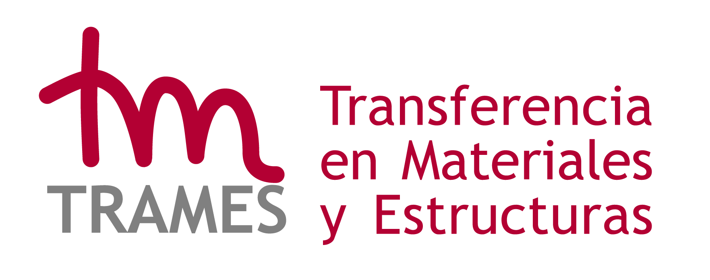

```{=html}
<section class="project-hero"><div><div class="kicker">COMES · UCLM · INAIA</div><h1>CORA</h1><h3>Estudio de la respuesta a CORtadurA en estructuras laminares fabricadas con material compuesto</h3><p class="lead-text">CORA se centra en la determinación fiable de la respuesta a cortadura pura en el plano de laminados FRP de pequeño espesor, combinando el ensayo biaxial tracción–compresión, métodos normalizados, medidas de campo completo y modelado numérico multiescala.</p><span class="status-pill ">Proyecto regional de investigación financiado · en ejecución</span><div class="button-row"><a class="btn-main" href="project.html">Conocer el proyecto</a><a class="btn-light" href="results.html">Resultados</a></div></div><div class="hero-media"></div></section>
```
```{=html}
<div class="fact-grid"><div class="fact"><strong>Referencia</strong>SBPLY/23/180225/000114</div><div class="fact"><strong>Periodo</strong>1 may 2024 – 30 abr 2027</div><div class="fact"><strong>IPs</strong>María del Carmen Serna Moreno · Juan José López Cela</div></div>
```
## Del método de ensayo a una capacidad transferible

CORA combina una comparación experimental rigurosa de métodos de cortadura con interpretación numérica, normalización y nuevo equipamiento. El objetivo no es solo publicar resultados, sino dejar un **procedimiento repetible, un dispositivo transferible y una infraestructura biaxial reforzada**.

## Entidades e infraestructura
```{=html}
<div class="logo-strip">
<a class="logo-box" href="https://www.uclm.es/" target="_blank" rel="noopener"></a>
<a class="logo-box" href="https://www.uclm.es/toledo/eiia" target="_blank" rel="noopener"></a>
<a class="logo-box" href="https://uclm-inaia.github.io/" target="_blank" rel="noopener"></a>
<a class="logo-box" href="https://www.uclm.es/grupos/COMES" target="_blank" rel="noopener"></a>
<a class="logo-box" href="https://www.uclm.es/grupos/comes/transferencia/utctrames" target="_blank" rel="noopener"></a>
</div>
```

## Financiación
```{=html}
<div class="logo-strip funding-strip">
<a class="logo-box" href="https://www.castillalamancha.es/" target="_blank" rel="noopener"></a>
<a class="logo-box" href="https://innocam.castillalamancha.es/presentacion-transformaclm-2025" target="_blank" rel="noopener"></a>
<a class="logo-box" href="https://fondoseuropeos.gob.es/es-es/fondosprogramas/feder/Paginas/feder.aspx" target="_blank" rel="noopener"></a>
</div>
```
```{=html}
<p class="logo-note">Proyecto regional apoyado por la Junta de Comunidades de Castilla-La Mancha / INNOCAM y cofinanciado por el Fondo Europeo de Desarrollo Regional (FEDER).</p>
```

## Resultados destacados
```{=html}
<div class="pub-grid">
<article class="pub-card"><span class="tag">Research output</span><h3>Comparison of the in-plane shear response of a FRP obtained by biaxial tension-compression test and standard methods</h3><p>M.C. Serna Moreno · S. Horta Muñoz · J. García-Delgado</p><p class="pub-meta">Composites Science and Technology 276 (2026) 111519</p><p><a href="https://doi.org/10.1016/j.compscitech.2026.111519">Open publication / record →</a></p></article>
<article class="pub-card"><span class="tag">Research output</span><h3>Recommended methodology in Specification UNE 0074:2023 to determine shear properties by means of the biaxial tension-compression test with a cruciform specimen</h3><p>M.C. Serna Moreno · S. Horta Muñoz · J.J. López Cela</p><p class="pub-meta">Revista de Materiales Compuestos (2025)</p><p><a href="https://doi.org/10.23967/r.matcomp.2025.07.03">Open publication / record →</a></p></article>
<article class="pub-card"><span class="tag">Research output</span><h3>Buckling analysis of laminates subjected to biaxial loads using cruciform specimens</h3><p>M.C. Serna Moreno · S. Horta Muñoz</p><p class="pub-meta">Materiales Compuestos 9 (2026), MATCOMP25 communications</p><p><a href="https://www.scipedia.com/profile/sergio.horta/contributions">Open publication / record →</a></p></article>
</div>
```