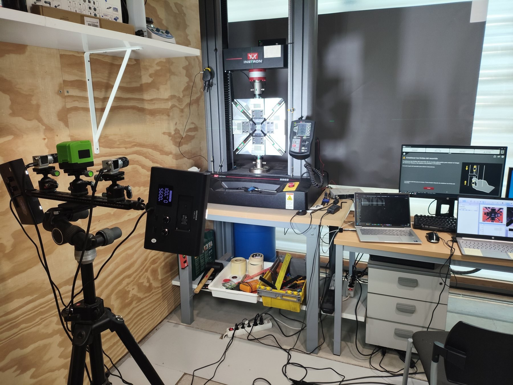

## Research challenge

The shear strength of FRPs remains one of the most difficult design properties to determine consistently. CORA advances a test methodology developed in COMMUL/BISHEAR and formalized in **UNE 0074:2023**, using a biaxial tension–compression (TC) test on symmetric ±45° cruciform laminates.

The project seeks to establish repeatability, compare the TC response with common standards, understand the mechanisms behind non-linear shear response and continue the path toward full standardization.

## Main objectives
```{=html}
<div class="card-grid"><div class="card"><h3>Accessibility & repeatability</h3><p>Develop a fixture for TC tests in uniaxial machines and verify repeatability across different testing systems.</p></div><div class="card"><h3>Comparison with standards</h3><p>Contrast TC results against ±45° tension, Iosipescu and V-notched rail shear methods, with particular emphasis on large-strain response and shear strength.</p></div><div class="card"><h3>Numerical interpretation</h3><p>Use progressive damage and micro-scale models to connect apparent response, microdamage, matrix plasticity and fibre reorientation.</p></div><div class="card"><h3>Standardization</h3><p>Validate UNE 0074:2023 and generate the technical basis required to progress toward a complete standard.</p></div></div>
```

## Research continuity

The research sits within the COMES line on experimental and numerical characterization of composite materials, with continuity from COMMUL and BISHEAR and direct connections with RENO/CORA.

```{=html}
<div class="media-row"><div class="media-image"></div><div><h3>TC test with cruciform specimen</h3><p>Equal-magnitude tension–compression loading of symmetric ±45° laminates enables the shear response in principal material directions to be studied while keeping the region of interest away from the grips.</p><p><a href="https://www.une.org/encuentra-tu-norma/busca-tu-norma/norma?c=N0071374">UNE 0074:2023 →</a></p></div></div>
```