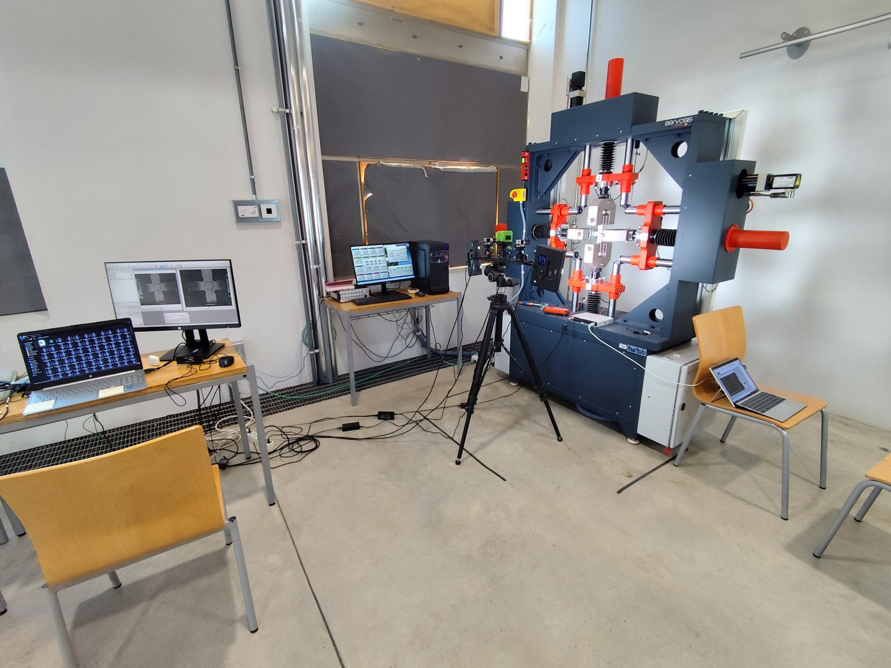
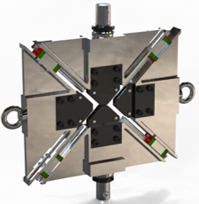

```{=html}
<p class="section-intro">Scientific, standardisation and technology-transfer outputs obtained within the CORA research line. Several results are shared with RENO and BISHEAR; they are included when they directly contribute to CORA objectives on shear characterisation, test comparison, accessibility and standardisation.</p>
```

## Key publications

```{=html}
<div class="pub-grid">
<article class="pub-card"><span class="tag">Journal article · 2026</span><h3>Comparison of the in-plane shear response of a FRP obtained by biaxial tension-compression test and standard methods</h3><p>M.C. Serna Moreno · S. Horta Muñoz · J. García-Delgado</p><p class="pub-meta">Composites Science and Technology 276 (2026) 111519</p><p><a href="https://doi.org/10.1016/j.compscitech.2026.111519">Open publication →</a></p></article>

<article class="pub-card"><span class="tag">Inverse identification · 2026</span><h3>Full-field elastic solution reconstruction of mechanical tests using a physics-based inverse method</h3><p>J.A. Sanz-Herrera · M.C. Serna Moreno · S. Horta Muñoz · R. Chamorro</p><p class="pub-meta">Composite Structures 387 (2026) 120278</p><p><a href="https://www.scopus.com/pages/publications/105035385857?origin=resultslist">Open Scopus record →</a></p></article>

<article class="pub-card"><span class="tag">Standardisation · 2025</span><h3>Recommended methodology in Specification UNE 0074:2023 to determine shear properties by means of the biaxial tension-compression test with a cruciform specimen</h3><p>M.C. Serna Moreno · S. Horta Muñoz · J.J. López Cela</p><p class="pub-meta">Revista de Materiales Compuestos (2025)</p><p><a href="https://www.scipedia.com/public/Serna_Moreno_et_al_2024a">Open publication →</a></p></article>

<article class="pub-card"><span class="tag">Biaxial stability · 2026</span><h3>Buckling analysis of laminates subjected to biaxial loads using cruciform specimens</h3><p>M.C. Serna Moreno · S. Horta Muñoz</p><p class="pub-meta">Materiales Compuestos 9 (2026)</p><p><a href="https://www.scipedia.com/public/Serna_Moreno_Horta_Munoz_2025a">Open publication →</a></p></article>
</div>
```

## UNE 0074:2023 · highlighted standardisation result

```{=html}
<div class="media-row"><div class="media-image"></div><div><span class="tag">Standardisation</span><h3>UNE 0074:2023</h3><p>The specification defines the shear test method based on biaxial tension–compression loading of cruciform specimens. CORA uses this pre-standard as a technical starting point for validation, comparison with established shear methods and further development toward complete standardisation.</p><p><a href="https://www.scipedia.com/public/Serna_Moreno_et_al_2024a">Read the paper describing the recommended methodology →</a></p><p><a href="https://www.une.org/encuentra-tu-norma/busca-tu-norma/norma?c=N0071374">Official UNE record →</a></p></div></div>
```

## Infrastructure and transferable results

```{=html}
<div class="media-row"><div class="media-image"></div><div><h3>New four-actuator biaxial testing capability</h3><p>CORA enabled the acquisition of the new Servosis biaxial testing machine with four synchronized actuators and four independent load cells, strengthening the experimental capacity available at INAIA/UCLM.</p></div></div>
```

```{=html}
<div class="media-row reverse"><div class="media-image"></div><div><span class="tag">Technology transfer</span><h3>Utility model application U202532647</h3><p><strong>Title:</strong> Device for performing biaxial tension-compression tests on a uniaxial machine.</p><p><strong>Applicant:</strong> Universidad de Castilla-La Mancha.</p><p><strong>Inventors:</strong> María del Carmen Serna Moreno, Sergio Horta Muñoz, Ayman Berrem Khalid and Claudia Llario Alegre.</p><p><strong>Filing/receipt date:</strong> 30 December 2025. The application is currently under examination and is not presented as a granted right.</p></div></div>
```
