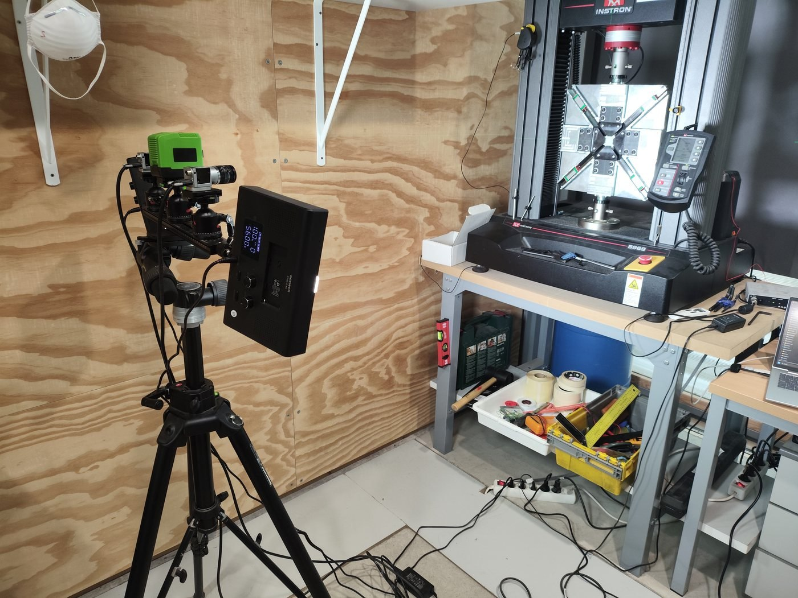
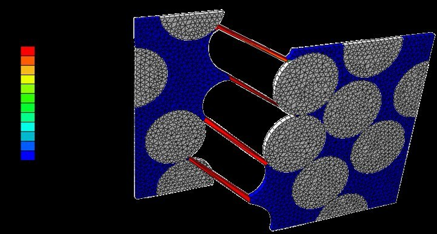

```{=html}
<p class="section-intro">Work structure defined in the scientific project memorandum.</p><div class="wp-grid"><div class="wp-card"><span class="tag">WP1</span><h3>Experimental characterization</h3><p>TC fixture for uniaxial machines; repeatability in multiple facilities; standardized shear campaigns; quantitative comparison between TC and standard methods.</p></div><div class="wp-card"><span class="tag">WP2</span><h3>Numerical simulation</h3><p>Mesoscale progressive-damage modelling and micromechanical RVEs with cohesive interfaces, matrix non-linearity and XFEM crack evolution.</p></div><div class="wp-card"><span class="tag">WP3</span><h3>Standardization process</h3><p>Validation of UNE Specification 0074:2023 and development of the associated normative document toward full standardization.</p></div></div>
```
## Methods and tools
```{=html}
<div class="media-row"><div class="media-image"></div><div><h3>Experimental mechanics</h3><p>Quasi-static tests, cruciform specimens, strain gauges and Digital Image Correlation for full-field displacement and strain measurement.</p></div></div><div class="media-row reverse"><div class="media-image"></div><div><h3>Numerical modelling</h3><p>ABAQUS/FEM, mesoscale progressive-damage models, micromechanics, homogenization, cohesive interfaces and XFEM.</p></div></div>
```